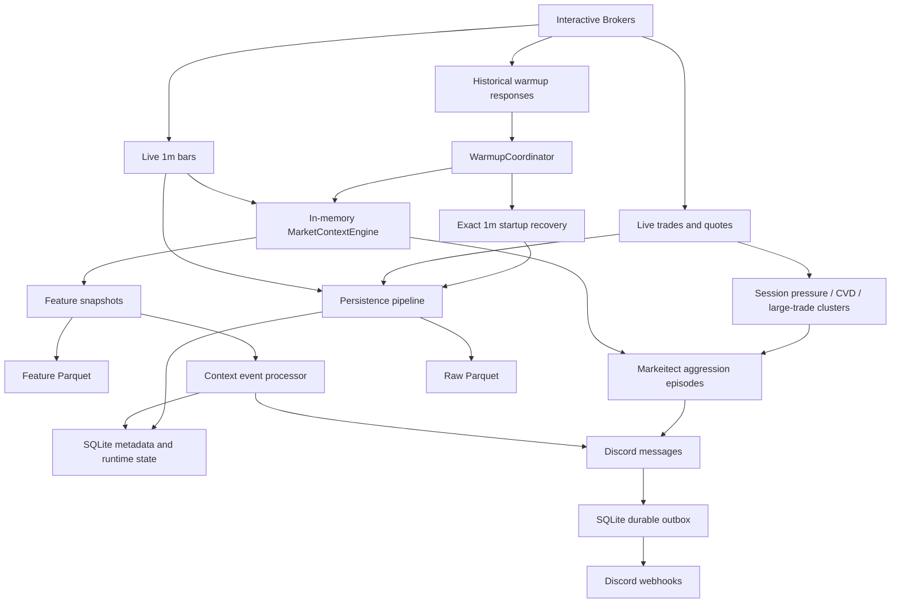

# Markeitech Runtime Data Flow Audit

**Status:** Analysis only; no runtime behavior changed
**Observed:** 2026-07-22 on `codex/markeitect-model`
**Scope:** LiveNode startup, historical warmup, live data, analytics, persistence,
runtime events, the Markeitect model, and Discord delivery.

## Executive Summary

The system is not fundamentally doing the same work twice, but several concerns
that were built together now need clearer boundaries:

1. **Analytical warmup is necessary.** The live analytics engine is in memory and
   does not restore its bar histories from the database. Historical IB requests
   build EMA, trend, value, profile, FVG, range, and support/resistance state before
   live processing starts.
2. **Persistence recovery is useful, but it is currently part of the startup gate.**
   Exact one-minute gap recovery delays live subscriptions even though a small gap
   is not trading-critical for Markeitech.
3. **The Markeitect order-flow model does not use the database to make live
   decisions.** It consumes classified live trades, in-memory CVD/session pressure,
   current analytics, and aggression-episode state.
4. **SQLite is still operationally important.** It provides commit metadata,
   deduplication, recovery evidence, durable context transitions, and the Discord
   outbox. It is not the primary market-data payload store.
5. **The largest current storage cost is metadata.** About 157 MB of the 167 MB
   SQLite file is the `persisted_event_identities` table and its indexes. Raw market
   Parquet is only about 19 MB in the observed workspace.
6. **The most important missing data path is model evidence.** Markeitect aggression
   episodes and outcomes are rendered to logs/Discord but are not yet stored as a
   compact structured dataset for calibration, replay, or ML.

The architecture is sound enough to continue. The next cleanup should focus on
making each workload intentional, not removing persistence wholesale.

## Runtime Topology

## Startup Sequence

The current startup order is deliberately conservative:

1. Load TOML configuration and build instrument plans.
2. Start persistence and replay any accepted-but-uncommitted ingress journal data.
3. Restore durable context-event checkpoints from SQLite and reconcile them against
   persisted feature history.
4. Request configured historical bars from IB, sequentially across instruments and
   timeframes.
5. Retry empty historical responses up to the configured limit.
6. Run exact one-minute persistence recovery for missing intervals.
7. Evaluate warmup depth/freshness readiness.
8. Initialize the in-memory analytics engine from historical responses.
9. Persist initial feature snapshots and emit the warmup operator context.
10. Subscribe to live one-minute bars for all enabled instruments.
11. Subscribe to trades and quotes for instruments configured `tick_by_tick`.

The important consequence is that **live subscriptions do not begin until both
analytical warmup and persistence recovery complete**.

## What Warmup Contains

The full live configuration currently requests these timeframes for every enabled
instrument:

| Timeframe | Lookback | Primary purpose | Assessment |
|---|---:|---|---|
| 1 minute | 5 sessions | Session VWAP/profile/ranges, recent structure, seed current higher-timeframe bucket | Needed, but its indicator scope can be reduced |
| 5 minute | 10 sessions | Intraday trend, levels, FVGs, EMA context | Needed |
| 15 minute | 20 sessions | Swing/intraday structure and levels | Needed |
| 30 minute | 5 sessions | Intermediate structure | Useful, but depth is close to the 200-bar boundary and should be reviewed |
| 1 hour | 60 sessions | Broader structure, levels, EMA context | Needed |
| 1 day | 260 sessions | Daily regime and long-horizon EMA/levels | Needed |

### What happens to warmup bars

- All timeframe responses are retained in the warmup response set long enough to
  initialize analytics.
- `MarketContextEngine` normalizes them and keeps up to 10,000 bars per
  instrument/timeframe in memory.
- Historical 5m, 15m, 30m, 1h, and 1d bars are **not** written as raw Parquet
  market bars. Their derived analytics are persisted as feature snapshots.
- Historical 1m bars are submitted to raw persistence because they are also used
  for continuity and startup gap recovery.
- Live higher timeframes are aggregated from completed live 1m bars. The warmup 1m
  data seeds only the currently forming aggregate bucket; complete historical
  higher-timeframe histories come from direct IB requests.

### Is warmup needed?

**Yes.** Removing it now would leave the live process without mature EMA, profile,
trend, level, and auction context until enough new bars accumulated. A daily EMA
could take months to mature and an hourly view could take days.

What is negotiable is not warmup itself, but:

- which calculations each timeframe performs;
- which instruments need which depths;
- whether exact archival gap repair must block live subscriptions;
- whether every warmup-derived revision needs durable feature storage.

## Live Data Flow

### Tick-by-tick instruments

The live configuration currently gives NQ and ES trade ticks, quote ticks, and 1m
bars. Each classified trade follows two independent paths:

1. **Persistence:** journal -> bounded writer -> raw Parquet plus SQLite commit and
   identity metadata.
2. **Markeitect flow:** session auction pressure/CVD -> large-trade burst classifier
   -> aggression episode tracker -> operator-flow/Discord rendering.

The second path is the live trading brain. It is in memory and does not query
SQLite or Parquet before classifying an event.

### Background instruments

The remaining live watchlist receives 1m bars. Those bars update analytics and are
aggregated into higher timeframes, but they cannot provide genuine trade-side CVD,
large prints, or trapped-participant evidence. Candle-derived pressure must remain
explicitly labeled as a proxy.

### Analytics commits

Each completed 1m bar updates the 1m snapshot. When an aggregate bucket completes,
it also updates the corresponding 5m/15m/30m/1h/1d snapshot. Feature envelopes are
written to feature Parquet, registered in SQLite, projected into context transitions,
and rendered to logs/Discord according to notification policy.

## Storage And Its Users

| Store | What it contains | Current writers | Current readers | Needed by live Markeitect decisions? |
|---|---|---|---|---|
| Raw Parquet (`data/catalog/data`) | Trade ticks, quote ticks, canonical 1m bars | Persistence pipeline | Startup recovery, static chart/research tools; legacy observation restore if enabled | No |
| Feature Parquet (`data/catalog/features/market_context`) | Versioned multi-timeframe context snapshots | Feature pipeline | Startup context reconciliation, chart/research tools; legacy signal restore if enabled | No, analytics are already in memory |
| SQLite (`data/runtime/markeitech.sqlite3`) | Commit metadata, event identities, checkpoints, transitions, outbox, recovery records, dormant signal state | Persistence, context-event, and notification components | Same components during recovery/delivery | Not for decisions; yes for durability |
| Ingress journal (`data/runtime/ingress-journal`) | Accepted events not yet durably committed | Persistence ingress | Persistence replay on restart | No, but protects accepted data |
| Process memory | Warmup histories, analytics, CVD, clusters, aggression episodes, proximity state | Live actors/engines | Live actors/engines | Yes |

### Components actively using SQLite

- Persistence coordinator: batch status and commit bookkeeping.
- Raw writer: per-event identities and duplicate prevention.
- Feature pipeline: durable feature commit sequence and identity.
- Startup recovery: recovered intervals and provider-empty evidence.
- Context event processor: detector checkpoints and durable transition events.
- Discord transport: persistent outbox, leases, retries, and delivery status.

### SQLite areas currently dormant

The generic/Valentini signal runtime is disabled because no definition IDs are
enabled. Its signal snapshots, transitions, and location-interaction tables remain
available but currently contain no rows and do not drive runtime behavior.

### What does not use the database

- Current indicator calculation and live market-context state.
- Session CVD and auction-pressure calculation.
- Large-trade burst classification.
- Aggression episode pending/with-flow/trapped decisions.
- Current Markeitect model state across a live process lifetime.

Therefore, deleting the database does not permanently delete the ability to build
levels: IB warmup rebuilds analytics. It **does** discard deduplication history,
feature/context checkpoints, recovery evidence, pending Discord messages, and all
other durable runtime state. It should never be purged while the process is running.

## Observed Storage Snapshot

At audit time:

| Item | Approximate size/count |
|---|---:|
| Raw market Parquet | 19 MB |
| Feature Parquet | 6.6 MB |
| Runtime directory | 161 MB |
| Log directory | 93 MB |
| SQLite file | 167.3 MB |
| Persisted event identities | 455,903 rows |
| Persistence batches | 1,946 rows |
| Feature commits | 715 rows |
| Context transition events | 144 rows |
| Notification outbox | 1,143 rows |
| Signal snapshots/transitions | 0 / 0 rows |

SQLite space is dominated by:

| SQLite object | Approximate size |
|---|---:|
| `persisted_event_identities` | 81.2 MB |
| Batch lookup index on event identities | 36.4 MB |
| Unique identity index | 20.0 MB |
| Retention index on event identities | 19.0 MB |

This means the current disk issue is not large candle files. It is per-event
identity bookkeeping for a high-volume tick stream. Automatic retention maintenance
is disabled in the live configuration, so configured retention ages are not being
applied automatically.

## Redundant Or Overbuilt Work

### 1. Exact gap recovery blocks trading readiness

The system first requests normal 1m warmup and then uses persisted 1m coverage to
request exact missing intervals. This is coherent for a lossless archive, but
Markeitech has explicitly accepted that a small historical gap is not trading
critical. Analytical readiness and archive completeness should eventually be two
separate states. Exact repair can continue after subscriptions start, provided it
cannot corrupt live ordering.

### 2. One policy is applied to nearly every instrument

The full live plan performs roughly 60 historical requests: ten instruments times
six timeframes, sequentially. Active and background instruments have different
roles, but currently receive nearly identical warmup breadth and indicator work.
That is a major source of startup duration.

### 3. Some configuration controls are descriptive only

`analysis_profile` and the `annotate_support_resistance`, `annotate_emas`,
`annotate_trend`, `annotate_vwap`, and `annotate_fvgs` flags are loaded and copied
into planning objects, but the analytics engine does not consult them. They do not
currently reduce or specialize calculation. Until wired through, they are promises
rather than controls.

### 4. One-minute analytics exceed current trading policy

The engine still computes and persists the full 1m analytical surface even though
1m trend maps and levels have been intentionally removed from decisions and Discord.
One-minute price/value state remains useful, but 1m swing levels, EMA trend maps,
and FVGs are currently computation and storage without a consumer.

### 5. Startup scans broad feature history

Context-event reconciliation loads persisted feature history for every enabled
instrument. This is correct for missed-transition recovery, but it will scale poorly.
An incremental query from each stored checkpoint/commit sequence would preserve the
behavior with bounded startup work.

### 6. Raw tick durability is strategically useful but operationally expensive

Persisted ticks are not used by today’s live model, yet they are the best future
source for replay, threshold calibration, and ML. The raw data should not be removed
casually. The expensive part is the one-SQLite-identity-per-event design, which can
eventually be replaced or bounded by batch/file-level identity and retention rules.

## Important Missing Work

### 1. Structured Markeitect model evidence

This is the highest-value missing path. For every aggression episode, retain a
compact record containing:

- instrument, timestamps, side, price, size, burst count, and classifier threshold;
- CVD before/after and percentage change;
- favorable/adverse excursion over fixed horizons;
- nearest meaningful locations and distances;
- trend/value/auction context at observation time;
- episode outcome: with-flow, trapped, expired, or unresolved;
- cross-market observations available at that timestamp;
- model/config version and input fidelity.

Without this, Discord and logs can demonstrate individual events, but threshold
calibration and ML cannot be performed reliably or repeatably.

### 2. Restart semantics for short-lived model state

Pending aggression episodes live only in memory. A restart forgets them. This is
probably acceptable while episode horizons are measured in seconds, but it should
be an explicit contract rather than an accident.

### 3. Instrument-specific analytical policy

The system has the vocabulary (`active_tick`, `background_bar`) but not the behavior.
It needs explicit per-role/per-instrument policies for warmup timeframes, depth,
enabled calculations, profiles, and notification eligibility.

### 4. A deliberate retention policy

Current manual purging works during development but prevents trustworthy long-term
datasets. Decide separately how long to retain:

- raw ticks and quotes;
- raw 1m bars;
- feature snapshots;
- compact Markeitect episode records;
- delivery and commit metadata;
- human-readable logs.

Compact model evidence should likely be retained much longer than raw per-tick
identity metadata.

## Recommended Order Of Work

This audit recommends no immediate runtime change while the current live test runs.
When cleanup resumes:

1. Add the compact, versioned Markeitect episode/outcome dataset.
2. Wire analysis profiles into actual calculation and warmup policies.
3. Stop calculating unused 1m level/trend/FVG families while retaining useful 1m
   price, value, auction, volume, and aggregation inputs.
4. Separate analytical readiness from exact persistence repair so small archive
   gaps do not block live subscriptions.
5. Add an explicit retention/compaction policy for event identities and logs.
6. Make feature-history reconciliation incremental from durable checkpoints.

The first item improves trading quality and future ML. Items two through six reduce
startup time, storage growth, and hidden complexity without changing the model’s
meaning.

## Bottom Line

The early work was not wasted: warmup, durable ingestion, feature history, context
events, and the outbox provide a strong base. The system now has enough real usage
to reveal where general infrastructure outran the current trading model.

Keep the multi-timeframe warmup. Keep durable Discord and compact context history.
Do not make perfect 1m archive repair a prerequisite for seeing the market. Most
importantly, start preserving the Markeitect model’s own observations and outcomes
as first-class data; that is the bridge from a working live system to measurable
trading quality.
