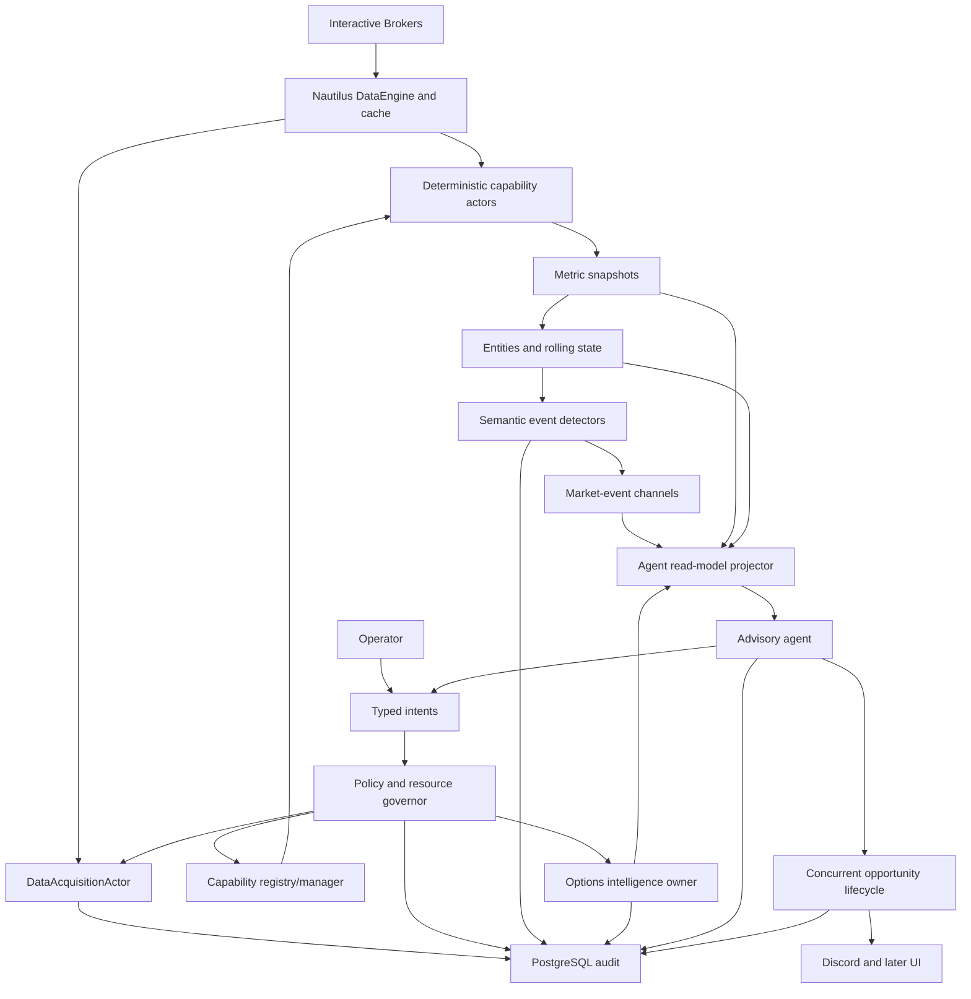

# V2 Market Events And Live Agent Blueprint

**Status:** Product direction approved; implementation details are approved stage by stage

**Scope:** Complete path from provider observations to auditable concurrent 0DTE advisory
opportunities

**Near-term sequence:**
[`v2-first-market-intelligence-coding-sequence.md`](v2-first-market-intelligence-coding-sequence.md)

This document is the canonical Stage 9A-9K product sequence. Focused stage plans may refine
implementation details, but they must not silently renumber, omit, or reorder the canonical stages.

## Purpose

This is the master blueprint for Markeitech's market-intelligence system. It describes the target
product, component ownership, data flow, contracts, persistence, analytical and model layers,
agent behavior, options intelligence, safety, observability, and delivery stages.

It is detailed direction, not blanket implementation approval. Every stage receives a focused
design review before code. Stage documents may refine this blueprint, but an approved change to
the destination must also update this file.

## Product Goal

Markeitech will convert live market evidence into an inspectable set of concurrent 0DTE advisory
opportunities for human judgment.

```text
Provider observations
    -> deterministic measurements
    -> analytical entities and rolling state
    -> quiet semantic events
    -> cross-instrument and options evidence
    -> advisory live agent
    -> policy-checked requests for additional work
    -> ranked concurrent opportunities or explicit abstention
    -> operator feedback and auditable outcomes
```

The initial configurable expression universe is SPXW, SPY, and QQQ 0DTE options. It is a seed, not
a permanent whitelist. No expression instrument is globally preferred.

The observation universe is broader and dynamic. ES, NQ, SPX, SPY, QQQ, VIX, sectors, leaders,
commodities, and later sources may provide evidence without becoming the proposed trade vehicle.
The system may maintain several opportunities at once and must not force one thesis, direction,
active instrument, or contract.

## Non-Negotiable Boundaries

- Markeitect has final authority over trading meaning and product behavior.
- NautilusTrader and its IB adapter own connectivity and native normalized market objects.
- `DataAcquisitionActor` owns logical provider demand and provider-facing subscription/request
  lifetime. Analytical actors do not connect to IB directly.
- Native high-volume observations stay on Nautilus paths and outside PostgreSQL.
- PostgreSQL stores meaningful operational, analytical, agent, opportunity, and delivery audit;
  it is not a raw tick/bar warehouse.
- Deterministic components calculate facts before ML or an LLM interprets them.
- Reported, derived, inferred, partial, stale, and unavailable evidence remain distinct.
- The agent receives compact state and typed tools, not raw ticks, arbitrary SQL/Python, provider
  APIs, database credentials, or unrestricted configuration.
- Every agent/operator request is policy checked, bounded, expiring where appropriate, and audited
  through its complete lifecycle.
- AI output is advisory. Automated execution is absent until separately designed and approved.
- Replay and backtesting remain out of scope until Markeitect explicitly reopens them.
- All variable market, analytical, timing, policy, product, and resource decisions follow the
  charter's configuration and optimization principle.

## Current V2 Foundation

The accepted foundation currently provides:

- one NautilusTrader `LiveNode` connected to Interactive Brokers paper data;
- explicit startup confirmation and read-only/data-only intent;
- system control, health evaluation, supervision, and rotating file logs;
- Discord system-health projection;
- PostgreSQL schema verification and operational-event audit;
- a configuration-owned bootstrap watchlist;
- native quote and external five-second-bar observation for that watchlist;
- one acquisition owner reconciling shared demand into provider subscriptions;
- native multi-actor delivery without a Markeitech raw-data fan-out wrapper; and
- bounded demand lifecycle facts: requested, subscribed, active, failed, canceled, and stopped.

V2 now has approved deterministic measurements and the Stage 9D typed entity/rolling-state
foundation through Slice 9D.4C. It does not yet have approved semantic interaction events, options
intelligence, an ML model, an advisory agent, an opportunity lifecycle, or execution. V1
analytical/signal models are reference material only.

## Target Topology



Boxes express ownership, not mandatory one-actor-per-box design. Components separate when
responsibility, lifecycle, workload, or failure isolation requires it, not for decorative
modularity.

## Domain Vocabulary

| Category | Meaning | Example |
|---|---|---|
| Native observation | Provider/Nautilus market object | Quote, trade, completed bar |
| Measurement | Deterministic numeric transformation | Spread, normalized return, VWAP |
| Entity | Stable analytical subject | Session, opening range, gap, level, zone |
| State | Bounded currently true projection | Evidence healthy, compression active |
| Event | Immutable meaningful transition | Gap filled, evidence became stale |
| Composite | Higher-order deterministic interpretation | Leadership disagreement |
| Model score | Versioned probabilistic estimate | Follow-through probability |
| Agent interpretation | Evidence-cited advisory synthesis | S&P catch-up thesis |
| Opportunity | Target-exposure decision episode | Bullish S&P 20-minute opportunity |
| Expression candidate | Possible vehicle | Specific SPXW or SPY call |
| Proposal | Operator-facing advisory output | Ranked contract/thesis/invalidation |

A changed metric is not automatically an event. A composite is not source truth. A model score is
not a trade. An affordable option is not an opportunity.

## Opportunity And Expression Model

### Opportunity identity

An opportunity is identified by target exposure, direction, decision horizon, market-structure or
relationship episode, evidence set/versions, trigger state, invalidation, and lifecycle identity.
It is not owned by the leading evidence instrument or a particular contract.

NQ may lead an aligned breakout while ES lags. With additional evidence, that can support an S&P
catch-up opportunity expressed through SPXW/SPY. The same graph may separately support QQQ
continuation. These remain independent opportunities with independent invalidations.

### Expression candidates

One opportunity may own multiple candidates. Selection considers:

- eligible product/session;
- fresh executable bid/ask, spread, and expected slippage;
- expiry, remaining trading time, strike, right, moneyness, and settlement;
- premium and buying-power policy;
- IV/Greeks when available;
- payoff geometry relative to thesis/horizon;
- liquidity and quote stability;
- contract-specific degradation; and
- uncertainty in the underlying reference.

The agent may rank several expressions, select none, or explain why a good thesis lacks a usable
contract.

### SPXW affordability discovery

During eligible Cboe sessions, continuously consider SPXW contracts in a configurable approximate
`$0.10-$2.00` premium band.

- Fresh executable ask determines long-option affordability.
- Midpoint ranks only with a valid two-sided quote and acceptable spread.
- `last` alone never establishes current affordability.
- The band discovers candidates; it does not establish direction, liquidity, quality, or product
  preference.
- GTH analysis distinguishes reported SPX from an ES-derived/other proxy reference.

## Component Ownership

### Session And Calendar Owner

Owns exchange/calendar identity, trade date, session identity, GTH/RTH/Curb/overnight/maintenance/
closed phases as applicable, transition timestamps, holidays, early closes, DST, and deduplicated
session transitions. It does not calculate signals or embed local-clock assumptions.

### Data Acquisition Owner

Owns logical live/historical demand; instrument resolution; provider subscription/reference
lifetime; deduplication, pacing, priority, timeout, retry, cancellation, and expiry; entitlement and
provider-capability evidence; first/stale observation lifecycle; and demand/resource reporting.

It does not interpret market meaning. After authorization and demand anchoring, capability actors
may consume native Nautilus callbacks directly.

### Capability Registry And Manager

Each approved capability declares:

- stable identity and semantic version;
- supported instrument characteristics;
- required live feeds and exact historical dependencies;
- output contracts, cadence, units, and nullability;
- bounded retained state;
- fidelity and unsupported cases;
- parameters and policy envelopes;
- estimated provider/CPU/memory cost;
- activation, reconfiguration, stale, recovery, and shutdown behavior; and
- health/audit events.

The registry expands an approved capability into dependencies. An agent cannot invent a formula or
free-form warmup request.

### Measurement Dependency And Resolution Policy

There is no universal base timeframe, canonical historical substrate, or mandatory resolution
pyramid. Every measurement declares its own provider/source, resolution, bounded lookback or time
bounds, session scope, price basis, volume requirements, and minimum fidelity. The selected
dependency must be the smallest and cheapest input that preserves the measurement's meaning.

Direct provider bars are preferred when they satisfy the exact contract. Aggregation is used only
when required by the measurement's semantics, provider availability, explicit session control, or
validated resource sharing. A higher timeframe never automatically derives from the timeframe
below it. Acquisition may deduplicate dependencies only when all material semantics are compatible;
sharing is an execution optimization, not an analytical rule.

Provider-native and locally aggregated representations require explicit equivalence validation
before either may substitute for the other. Validation covers interval identity, calendar/session
assignment, OHLCV, downstream output, and configured tolerances. Fidelity differences remain
visible. For example, prior-day OHLC may use a direct daily bar, while an opening range requires
intraday observations and weekly structure may use direct weekly bars or validated daily-to-weekly
aggregation. Long one-minute downloads are never required merely to manufacture coarser history.

### Deterministic Capability Actors

Own measurement calculation for separately approved families: quote/liquidity, session/range,
returns/volatility, trend/efficiency/compression, gaps/opening ranges, volume-aware analytics,
levels/zones/profiles, true trade response, cross-instrument relationships, and options. They
publish typed output and health; they do not render Discord, query arbitrary SQL, call an LLM, or
decide trades.

### Entity And Rolling-State Owners

Own stable identity and current projections for sessions, reference sets, opening ranges, gaps,
levels/zones/profiles, relationship episodes, option candidate sets, opportunity evidence graphs,
and health. Every entity defines creation, revision, expiry, invalidation, replacement, and
session/contract rollover. Cardinality and history are explicitly bounded.

### Semantic Event Detectors

Own transition predicates/hysteresis, identity/deduplication, causation/correlation, event and
publication time, expiry/invalidation, evidence/fidelity requirements, direction/horizon, and
downstream inference limits. They suppress insignificant numerical churn.

### Intent Policy And Resource Governor

Authorizes operator/agent intents against allowed types, scope, parameter bounds/mutability,
session eligibility, entitlement, provider support, pacing, budgets, priority, leases, expiry,
runtime health, and requesting authority. Outcomes are accepted, modified, queued, rejected,
expired, or canceled. Enforcement is deterministic and audited.

### Options Intelligence Owner

Owns expiration/contract discovery, bounded strike windows, quote/Greek demand, chain freshness,
candidate quality/rejection reasons, GTH/RTH/Curb eligibility, cash/proxy distinction, candidate
lifecycle, and compact option-state projection. It separates underlying thesis from expression
quality.

### Agent Read-Model Projector

Builds a compact timestamped view containing runtime/provider/session/evidence health, relevant
versioned metrics, active entities/events, relationships, option candidates, opportunities,
intent outcomes, conflicts, uncertainty, and stale/missing sections. It excludes raw streams,
unlimited history, credentials, unrelated watchlist noise, and prose as source truth.

### Advisory Live Agent

May inspect state, maintain concurrent hypotheses, cite support/conflict/missing evidence, request
approved observation/history/capabilities/focus/options, rank expressions, and publish proposals,
revisions, invalidations, or abstentions.

It cannot connect to IB, read arbitrary raw streams/SQL, modify code/schema/config outside typed
tools, change policy envelopes, hide missing evidence, invent facts, or execute orders.

### Opportunity Lifecycle Owner

Maintains deterministic lifecycle:

```text
observing -> candidate -> proposed -> revised -> invalidated | expired | closed
```

Operator disposition and realized outcome are separate records. Every revision preserves exact
evidence, parameter, model, prompt, policy, and agent versions.

### Projection Actors

Render existing events/opportunities to Discord and later UI. They own format, route, cooldown,
deduplication, retry, and delivery outcome, but never recalculate meaning.

## Data Flow And Bus Contracts

### Native path

```text
IB -> Nautilus adapter -> DataEngine/cache -> native actor handlers
```

Acquisition authorizes/anchors demand. Raw observations are not copied to PostgreSQL or republished
as semantic events just to create another bus.

### Control and semantic paths

Low-volume typed messages use named Nautilus channels for acquisition intents/lifecycle,
capability intents/health, session/evidence state, justified metric snapshots, entity lifecycle,
semantic events, options lifecycle, policy decisions, agent tools, opportunities, operator
feedback, and notification outcomes.

### Universal contract envelope

Cross-component/durable contracts define:

- contract name and schema version;
- message/event, run, source, and subject identity;
- effective/event, observed, received, and published timestamps as applicable;
- sequence/revision where ordering matters;
- causation and correlation identity;
- parameter/config version;
- evidence references/fidelity;
- expiry/invalidation semantics; and
- bounded typed payload.

Event time and processing time remain explicit. Log position is not an ordering contract.

### Delivery semantics

Default to at-least-once publication with idempotent durable consumers. Exactly-once is never
assumed. Every channel documents publisher, authorized consumers, ordering boundary, retries,
deduplication, queue/backpressure, late/stale policy, persistence, and shutdown behavior.

## Evidence Health

Every analytical output carries source/feed, instrument/contract, event/receive/calculation time,
age/freshness, entitlement/subscription state, completeness/missing reasons, fidelity, session
alignment, warmup/readiness, correction/conflict state, and lineage to evidence/parameters.

Health is dimensional. The process may be connected while one instrument is stale; a metric may
exist numerically while analytically unready. One global boolean must not hide that.

## Historical Data And Warmup

History satisfies declared live dependencies, not replay storage:

1. Capability declares exact history.
2. Registry expands it for instrument and parameter version.
3. Policy validates depth, pacing, scope, and budget.
4. Acquisition deduplicates/schedules provider requests.
5. Responses reach the capability transiently.
6. Capability validates completeness and publishes readiness/degradation.
7. Only approved derived entities/summaries persist.

No actor makes arbitrary IB history calls and no universal timeframe/lookback matrix exists.
Requirements may vary by capability, instrument class, session, regime, or parameter version.
Restart restores compact state only where it cannot be cheaply/honestly rebuilt.

## Analytical Model

### Baseline candidates

The first reviewed catalog should cover reusable questions: bid/ask/mid/spread, completed-bar
OHLCV and normalized return, session range/location, previous-session references, overnight range
and gap, opening range, VWAP where volume is meaningful, realized range/volatility, directional
efficiency, and compression/expansion. These are candidates, not a frozen indicator catalog.

### Richer capabilities

Later approved work may include multi-horizon structure; level/zone/gap/profile entities;
approach/test/accept/reject/hold/fail/target interaction; participation/distribution; observed
trade response/CVD where classification is defensible; separately named bar proxies; effort versus
response; liquidity behavior; volatility regimes; cross-instrument leadership/lag/catch-up; option
and underlying behavior; and compact prior-session/power-hour summaries.

Every metric must earn inclusion through a decision question and state inputs, formula, horizon,
warmup, fidelity, failure behavior, cost, and event use.

### Cross-instrument state

Relationships are dynamic and horizon-specific, not permanent rules. Initial structural groups may
include SPX/ES/SPY, NQ/QQQ, VIX context, and other instruments only for justified questions.
Measure freshness-aligned normalized or volatility-adjusted movement, association, disagreement,
lead/lag hypotheses, participation differences, and regime. Correlation is not causation; relation
confidence decays/expires when support disappears.

## Semantic Event Model

Layers are observation (minimal interpretation), interpretation (approved inference), and
composite (several named inputs). Each definition states permitted and forbidden downstream
inferences.

Initial families, subject to stage approval, include session/evidence/capability transitions;
opening-range/gap/volatility/compression changes; approach/test/accept/reject/hold/fail at approved
entities; relationship alignment/disagreement/leadership/lag; option candidate band/tradeability/
degradation; and opportunity candidate/proposal/revision/invalidation/expiry.

Keep direction, horizon, magnitude, confidence, urgency, exposure relevance, novelty, fidelity, and
remaining validity separate. A rank may consume them later; it may not erase them.

## Options Intelligence

### Product/session identity

Model SPXW GTH, RTH, and Curb separately with exchange time/calendar. Model SPY/QQQ eligibility
independently. Contract identity includes underlying, expiry, strike, right, multiplier, exchange,
settlement style, and last eligible trade time.

### Bounded acquisition

Do not stream an unrestricted chain. Identify eligible expirations, choose a bounded strike window
around a trustworthy reference, request a limited quote/Greek set, evaluate quote/contract quality,
release irrelevant subscriptions, and refresh by configurable cadence, movement, session, and
agent intent.

### Underlying reference

Outside cash hours, stale SPX cannot masquerade as live. Reference state can include reported SPX
and age, ES/session, recently observed basis, separately named projected SPX, timestamp alignment,
fidelity, and invalidation when basis/inputs are stale.

### Contract evidence

Minimum evidence: bid/ask/mid/last/spread/age, two-sided/uncrossed/non-stale validity, volume/OI
when correctly available, IV/Greeks with source/time, underlying/moneyness/strike distance, time to
RTH/expiry/last trade, premium band, fillability/slippage class, rejection reasons, and fidelity.

Underlying direction and expression quality remain separate. A bad contract does not invalidate a
thesis; an attractive premium does not create one.

## Persistence And Retention

| Data class | Live owner/location | PostgreSQL policy | Restart behavior |
|---|---|---|---|
| Native ticks/quotes/bars | Nautilus path/bounded memory | Never raw | Re-fetch only for live need |
| Historical responses | Transient warmup | Never raw by default | Re-request |
| Metric snapshots | Capability memory | Approved checkpoints/summaries only | Per capability contract |
| Analytical entities | Owner state | Meaningful identity/revisions if approved | Restore or rebuild explicitly |
| Semantic events | Bus/projector | Lifecycle/evidence references | Restore projection/checkpoint |
| Session summaries | Compact derived state | Persist when future live session needs them | Restore prior evidence |
| Option chain data | Bounded candidate state | No full-chain retention by default | Refresh |
| Option candidate decisions | Options owner | Lifecycle/rejections/evidence | Restore only if still useful |
| Agent read model | Generated projection | Exact decision snapshot only when used | Audit, not live restore |
| Agent intents/tools | Bus/policy | Full lifecycle | Reconcile valid active leases |
| Opportunities/proposals | Lifecycle owner | All revisions/evidence/disposition | Restore if still valid |
| Prompts/responses | Restricted audit if approved | Redacted, explicit retention | Accountability/evaluation |
| Feedback/outcomes | PostgreSQL | Versioned labels/provenance | Evaluation/ML |
| Logs | Rotating files | Do not duplicate line by line | Operations only |

PostgreSQL is the operational and semantic audit, not the bus. It records run/connection/health;
acquisition/history lifecycles; capability versions/readiness; approved entity/event lifecycles;
policy and leases; option request/candidate decisions; agent invocation/evidence/tools; opportunity
revisions; notification delivery; and operator feedback.

Use explicit migrations, schemas, idempotency, transaction boundaries, retention, and boot-time
schema verification. Required persistence failure must affect health/lifecycle honestly.

Redis is deferred until measured cross-process need. Parquet is not selected merely because V1
used it. A vector DB may later index research but never becomes evidence truth. LLM transcripts are
not canonical opportunity records.

## Configuration And Optimization

Explicit typed/versioned configuration covers instruments/contracts, feeds/history, sessions,
horizons/windows/lookbacks, freshness, detector thresholds/hysteresis, capability parameters,
relationships, option premium/strike/spread/liquidity/Greeks, scoring, resource budgets, agent
cadence/model/context/tool permissions, Discord routing, and retention.

Every parameter defines identity, meaning, unit/type, default, scope, validation envelope,
mutability class, source, version/effective time, and rollback/audit. Initial code may load at
startup only, but contracts remain ready for policy-controlled runtime mutation. Models/agents use
typed intents and never rewrite config files or arbitrary globals.

## Statistical And ML Models

ML answers named bounded questions only after deterministic features/outcomes are trustworthy.
Potential questions include follow-through probability for a named event/horizon; acceptance vs
rejection at an entity; leadership persistence/catch-up; candidate fillability/degradation;
opportunity ranking; and threshold/resource optimization. Never train an undefined “price goes up”
target.

Features require deterministic formula/parameter versions, evidence fidelity/missingness,
instrument/session identity, information cutoff, event/opportunity identity, outcome definition,
and label provenance. Screenshots/notes are research evidence, not the production feature store.

Evaluation requires simple baselines, temporal/regime splits, no future/revision/contract leakage,
separate calibration/discrimination/abstention/stability/utility, frozen definitions, and live drift
monitoring. Support shadow deployment, rollback, and champion/challenger comparison.

Each model records identity/version/purpose, approved inputs/output, training dataset/evaluation,
operating envelope/abstention, mode (offline/shadow/advisory/disabled), resource budget, drift
health, rollback, and links every score to model/features. Models cannot subscribe, call IB, alter
policy, or execute.

## Live Agent Design

The agent is a stateful advisory reasoner, not the market-data processor. It directs attention,
requests bounded evidence, maintains hypotheses, compares expressions, and explains opportunities
or abstention.

Invocation may follow meaningful events, session transitions, material opportunity/option changes,
operator request, bounded heartbeat, or tool completion/failure. Cadence, coalescing, cooldown,
context budget, and model selection are configurable. Raw update frequency never equals LLM
invocation frequency.

Illustrative typed tools (finalized in their stage):

- `get_market_state(scope, horizons)`;
- `get_evidence_health(subjects)`;
- `request_observation(instrument, feeds, lease, purpose)` / release;
- `request_capability(subject, capability, parameters, lease, purpose)`;
- `request_historical_evidence(dependency, bounds, purpose)`;
- `request_focus(subjects, fidelity, lease, purpose)`;
- `request_option_candidates(exposure, expiry_policy, bounds, purpose)`;
- `get_opportunity`, `upsert_opportunity`, `invalidate_opportunity`; and
- `abstain(scope, missing_or_conflicting_evidence)`.

Every call has policy and execution lifecycle. “Accepted” never means data is already flowing.

Every proposal includes identity/revision, exposure/direction/horizon, lifecycle, thesis, supporting
and conflicting evidence citations, missing/stale evidence, trigger status, invalidation/expiry,
ranked expressions, contract rationale, liquidity/payoff constraints, model scores/versions,
uncertainty/alternative, follow-up requests, and advisory/no-execution label. Abstention is valid.

Audit enough to reconstruct decisions: model/provider/version, prompt template, tool schemas,
read-model/evidence snapshot, inference parameters, tool calls/results, structured output,
validation/policy, latency/token/cost/failure. Redact secrets and apply retention.

## Safety, Security, And Resources

- Credentials/webhooks remain secret and never enter prompts/events.
- Typed tools use least authority; budgets are enforced outside the agent.
- External news/web/model text is untrusted, sourced evidence and cannot grant permissions.
- No order-routing tool exists.
- Later execution requires separate risk/account/order/approval/kill-switch/reconciliation design.
- Overrides are authorized, explicit, expiring where appropriate, and audited.
- Degradation narrows/disables affected conclusions instead of silently lowering standards.

Govern live subscription count, historical pacing, option discovery/Greeks, capability CPU/memory/
queues/cadence, state cardinality, PostgreSQL latency/growth, agent rate/context/latency/cost, and
Discord queue volume. Temporary expensive work uses purpose/priority/owner/resource/start/expiry/
renewal/cancellation focus leases. Exhaustion emits explicit policy/health outcomes.

## Failure And Recovery

Every component specifies provider reconnect, entitlement/resolution failure, stale/late/corrected/
out-of-order data, incomplete warmup, exceptions/overload, PostgreSQL failure, option/Greek gaps,
agent timeout/malformed output/tool loop/model outage, Discord failure, and active-work shutdown.

Ingestion survives nonessential analyzer/agent/projection failure. Stale state is marked. Required
durability precedes dependent lifecycle publication. Restart restores only still-valid state and
expires obsolete leases/opportunities. Demand reconciles after reconnect. Agent failure never
erases deterministic state. Shutdown is bounded and honest about unfinished work.

Across every stage, runtime composition is event-driven rather than startup-sequenced. Actors may
start and report in any order; readiness is the convergence of independently evidenced component
states. A failed capability remains bounded, observable, and retryable under configuration while
unrelated capabilities continue. No actor may rely on sleeps, arbitrary ordering delays, or nested
framework mutation from another actor's synchronous callback.

## Observability And Operator Experience

Rotating files remain the diagnostic stream; high-volume observations are summarized by default.
Structured logs identify run, component, event, subject, correlation, lifecycle, and failure.

Discord is projection, not truth. Separate system degradation, market context/events, option and
opportunity lifecycle, agent proposals/invalidations/abstentions, and low-priority operational
detail. Routing, mentions, cooldown, grouping, and severity are configurable. Delivery failure
does not stop ingestion/analysis.

Health is hierarchical: runtime, provider, persistence, acquisition/feed, capability,
instrument/contract evidence, options, agent/model, notification, and end-to-end advisory
readiness. “Connected” is not “ready to advise.”

## Testing And Acceptance

Offline tests cover schemas, calendars/DST/holidays, demand/policy reconciliation, metric fixtures,
entity lifecycle, event hysteresis/dedup/order, persistence/restart, option filtering/quote quality,
opportunity lifecycle, agent structured output/tool policy, failures, and resource bounds.

Integration covers Nautilus bus delivery, PostgreSQL, dependency execution, event/read-model
projection, policy/tool lifecycle, decision reconstruction, and Discord delivery separation.

Manual IB acceptance is run by Markeitect when requested and records session, settings,
entitlements, contracts, expectation, lifecycle/logs, independent reference, and fidelity gaps.
Codex does not launch live IB runs without asking.

Evaluate separately: source/metric correctness, semantic honesty, operator utility, agent use,
contract executability, and predefined outcome. A win is evidence, not universal validation; a loss
does not automatically prove the process wrong.

## Delivery Plan

```text
Session/calendar ownership
    -> evidence-health contracts
    -> historical dependency execution
    -> baseline metric contracts
    -> entities and rolling state
    -> first semantic events
    -> bounded options-data proof
    -> cross-instrument state
    -> richer analytics
    -> agent read model, policy, and tools
    -> concurrent advisory opportunities
    -> evaluation and ML readiness
```

### 9A: Session And Evidence Truth

Authoritative calendar owner, evidence-health contract, quiet transitions, semantic audit, and
restart/DST/holiday/stale/degraded behavior.

**Exit:** every downstream value identifies its session and proves evidence usability.

### 9B: Historical Dependency Execution

Capability-declared history, policy/resource validation, acquisition pacing/dedup/timeout/cancel,
transient delivery, explicit readiness, and independent per-measurement resolution contracts.

**Exit:** capabilities receive exact bounded warmup without provider ownership.

### 9C: Baseline Metric Contracts And Runtime

Approved catalog, registry entries, bounded deterministic implementations, versioned parameters/
health, native updates, and independent validation.

**Exit:** trusted reusable measurements run continuously.

### 9D: Entities And Rolling State

Approved identity/revision contracts and bounded projection for objective sessions/references/
levels; volatility and compression/expansion; horizon-specific direction/trend/rotation;
moving/anchored references; swings/FVGs/derived zones; and explicitly inferred bar-volume
distribution/profile nodes. Include expiry/invalidation/roll, compact prior summaries, restart
semantics, and typed/versioned configuration plus optimization metadata for every variable policy.
Observed trade-at-price profiles remain separate later evidence.

**Exit:** stable analytical subjects are shared without duplicated meaning.

### 9E: First Semantic Events

Minimal envelope/taxonomy, explicit transitions/hysteresis, lineage/dedup/expiry/invalidation, bus
publication, audit, and quiet human projection after acceptance.

**Exit:** useful evidence-linked events run without numerical noise.

### 9F: Bounded Options Proof

SPXW/SPY/QQQ discovery; SPXW GTH/RTH/Curb; named reference/proxy; bounded strikes/quotes/Greeks;
quote/premium/candidate quality; resource lifecycle; and paper acceptance.

**Exit:** usable bounded 0DTE expressions can be identified truthfully.

### 9G: Cross-Instrument State

Structural groups, freshness-aligned comparisons, alignment/disagreement/leadership/lag/regime,
decay, and target-exposure linkage.

**Exit:** relationships support multiple independent opportunities.

### 9H: Richer Analytics

Add one approved decision capability at a time beyond the Stage 9D deterministic baseline:
observed trade-at-price profiles, participation, effort/response, advanced structure/location
interactions, or option-underlying behavior. Expensive work uses focus leases.

**Exit:** evidence is rich enough for useful theses while truthful and bounded.

### Mandatory Reliability Gate Before 9I

No live model access or agent-directed runtime intent begins until the current provider and
runtime recovery debt is closed or explicitly accepted by Markeitect. The gate must prove:

- provider subscription failure is retried or rejected through a bounded, observable lifecycle;
- connection loss and recovery can move affected evidence through degraded/unavailable and back to
  ready without restarting unrelated capabilities;
- queue and publication overflow remain bounded, audited, and recoverable where policy permits;
- retry, lifecycle, recency-decay, and hysteresis behavior has deterministic offline coverage; and
- one connected acceptance run reconciles recovery, resource, persistence, and shutdown evidence.

This gate hardens the evidence path. It does not authorize semantic thresholds, options selection,
agent behavior, or execution.

### 9I: Agent Read Model, Policy, And Tools

Compact read model, typed intents/tools, policy/budgets, lifecycle audit, citation/abstention,
model/prompt/tool audit, and deterministic fixtures before live model access.

The advisory live agent is named **Sir Loke**. Its governing maxim is:

> "When you have eliminated the impossible, whatever remains, however improbable, must be the
> truth." - Sherlock Holmes

For Sir Loke, elimination is an auditable process, not rhetoric. Deterministic policy removes
ineligible actions; evidence quality removes unsupported interpretations; contradictions remain
visible; and every surviving opportunity cites why it remains possible. An improbable opportunity
may survive when evidence supports it, but Sir Loke must abstain when elimination leaves ambiguity
rather than a defensible case.

**Exit:** an agent requests bounded work without controlling infrastructure.

### 9J: Concurrent Advisory Opportunities

Plural opportunity/expression state, proposal/revision/invalidation/expiry, evidence-cited output,
ranking without forced winner, Discord, operator disposition, and no-execution enforcement.

**Exit:** one, several, or no honest 0DTE opportunities reach human judgment.

### 9K: Evaluation And ML Readiness

Outcome/feedback contracts, leakage-safe datasets, baselines, temporal/regime evaluation, shadow
models, monitoring, and bounded optimization interfaces.

Before any model-training implementation, Markeitect must approve a data strategy defining the
historical acquisition source, reproducible feature construction, labels and outcome windows,
as-of cutoffs and revision handling, licensing and retention, dataset identity/versioning, and
leakage-safe temporal evaluation. The current no-raw-retention and no-replay decisions remain in
force until that explicit gate changes them; Stage 9K must not quietly turn PostgreSQL into a raw
market-data warehouse.

**Exit:** models improve named decisions without replacing truth or policy.

## Accepted Decisions

1. Initial expressions are configurable/expandable SPXW, SPY, and QQQ.
2. No expression product is globally preferred.
3. Opportunities are plural and identified by target exposure/episode, not source instrument or
   contract.
4. NQ leadership may support lagging S&P and distinct QQQ opportunities.
5. SPXW `$0.10-$2.00` is configurable discovery during eligible sessions, not a trade rule.
6. Initial parameters may be startup-only but include optimization metadata/future typed mutation.
7. Reconstructable raw market data is not persisted for replay/backtesting.
8. PostgreSQL is the operational/semantic audit, not raw storage.
9. The agent can direct attention/request approved work, but cannot access IB or execute.

## Deferred Design Gates

- calendar library/session source;
- first metric catalog/formulas;
- level/zone/profile/relationship entity schemas;
- event names/thresholds/hysteresis;
- durable prior-session summaries;
- option cadence/strike rules/provider budget;
- cross-instrument metrics/decay;
- first ML target/evaluation;
- agent provider/model/cadence/context/cost;
- opportunity ranking/operator feedback; and
- retention for agent/opportunity/model/notification records.

These are not blanks for code defaults. They require stage review with Markeitect.

## Immediate Next Batch

Stage 9D is active through connected-accepted Slice 9D.4C. The 2026-08-24 London/ETH run exercised
the optional runtime projection with actual rolling inputs, valid revisions, periodic staleness
reconciliation, bounded resources, reconciled operational persistence, and clean shutdown.
Markeitect explicitly deferred the narrow 9D.3 opening-range developing-to-complete proof until a
run crosses that configured boundary; it does not block 9D.5 swing/FVG/zone projection. The exact
implementation boundary remains in
[`v2-stage-9d-entities-rolling-state-plan.md`](v2-stage-9d-entities-rolling-state-plan.md).
