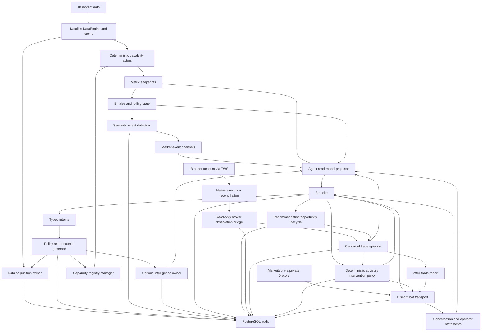

# Sir Loke V1 Delivery And Market-Evidence Blueprint

**Status:** Product direction and delivery order accepted on 2026-09-05; implementation details
remain approved batch by batch

**Scope:** Shortest honest path from the implemented V2 foundation to a live private Sir Loke who
recommends, observes, monitors, mentors, governs advisably, and reports on SPXW/QQQ 0DTE trades

The canonical product behavior is defined in
[`../product/sir-loke-v1.md`](../product/sir-loke-v1.md). Earlier Stage 9A-9K names remain stable
historical and technical scope identifiers, but they are no longer a strict instruction to finish
every planned analytical stage before showing the first useful Sir Loke experience. This blueprint
maps reusable completed and unfinished work into the new product-first delivery path.

## Purpose

This is the master delivery blueprint for Markeitech's first product. It describes component
ownership, data flow, broker observation, trade lifecycle, contracts, persistence, analytical and
model layers, Sir Loke behavior, options intelligence, Discord conversation, safety,
observability, and delivery gates.

It is detailed direction, not blanket implementation approval. Every stage receives a focused
design review before code. Stage documents may refine this blueprint, but an approved change to
the destination must also update this file.

## Product Goal

Markeitech will provide Markeitect with a live Discord trading companion who converts admitted
market, options, broker, trader, and policy evidence into inspectable 0DTE recommendations,
continuous trade monitoring, firm advisory intervention, abstention, and after-trade reports.

```text
Provider observations
    -> deterministic measurements
    -> analytical entities and rolling state
    -> minimum semantic/options evidence corridor
    -> compact Sir Loke read model
    -> recommendation or explicit abstention

TWS broker observations
    -> read-only reconciliation and sanitized trade facts
    -> canonical trade episode

Discord conversation <-> Sir Loke reasoning and advisory policy
    -> monitoring, challenge, acknowledgement, cooldown, and report
    -> auditable trader disposition and outcome
```

The first-version expression products are SPXW and QQQ 0DTE options. They are a delivery boundary,
not a permanent whitelist. SPY and other products remain later candidates, and no expression
instrument is globally preferred.

The observation universe is broader and dynamic. ES, NQ, SPX, SPY, QQQ, VIX, sectors, leaders,
commodities, and later sources may provide evidence without becoming the proposed trade vehicle.
The system may maintain several opportunities at once and must not force one thesis, direction,
active instrument, or contract. The first acceptance may prove a small number of simultaneous
episodes, but the contracts must not encode a one-opportunity or one-position invariant.

## Non-Negotiable Boundaries

- Markeitect has final authority over trading meaning and product behavior.
- NautilusTrader and its IB adapter own connectivity and native normalized market objects.
- `DataAcquisitionActor` owns logical provider demand and provider-facing subscription/request
  lifetime. Analytical actors do not connect to IB directly.
- Broker account/order/fill/position observation is a separate read-only responsibility. It uses
  the narrowest safe Nautilus-native execution/reconciliation boundary and publishes sanitized
  immutable facts; it does not give Sir Loke an execution client or mutable order object.
- Native high-volume observations stay on Nautilus paths and outside PostgreSQL.
- PostgreSQL stores meaningful operational, analytical, agent, opportunity, and delivery audit;
  it is not a raw tick/bar warehouse.
- Deterministic components calculate facts before ML or an LLM interprets them.
- Reported, derived, inferred, partial, stale, and unavailable evidence remain distinct.
- Sir Loke receives compact state and typed read-only tools, not raw ticks, arbitrary SQL/Python,
  provider APIs, database credentials, mutable broker/framework objects, or unrestricted
  configuration.
- Every agent/operator request is policy checked, bounded, expiring where appropriate, and audited
  through its complete lifecycle.
- Sir Loke v1 is advisory even when it firmly challenges, requires acknowledgement, recommends a
  close, or withholds its own recommendations during a cooldown. No order-action surface exists.
  Future broker-side execution requires a separate product, risk, security, and architecture
  approval.
- Replay and backtesting remain out of scope until Markeitect explicitly reopens them.
- All variable market, analytical, timing, policy, product, and resource decisions follow the
  charter's configuration and optimization principle.

## Current V2 Foundation

The implemented foundation currently provides:

- one NautilusTrader `2.0.0rc4` `LiveNode` configured for Interactive Brokers paper market data;
- explicit startup confirmation and read-only/data-only intent;
- system control, health evaluation, supervision, and rotating file logs;
- optional outbound Discord system-health webhooks, not an inbound bot;
- PostgreSQL schema verification and operational-event audit;
- a configuration-owned bootstrap watchlist;
- native quote and external five-second-bar observation for that watchlist;
- one acquisition owner reconciling shared demand into provider subscriptions;
- native multi-actor delivery without a Markeitech raw-data fan-out wrapper; and
- bounded demand lifecycle facts: requested, subscribed, active, failed, canceled, and stopped.

Earlier profiles supplied bounded deterministic measurement/entity evidence, while the active V3
profile now contains only eight calendar/evidence/acquisition/probe/persistence actors. V3-03
Slices 1-2 provide inactive replacement contracts and a disabled completed-bar foundation;
Slices 3-9 are incomplete. The runtime has no broker execution client, account/order/fill/position
observation, trade episode, semantic interaction events, options intelligence, live model, Sir
Loke, conversational Discord bot, opportunity lifecycle, or order action. See
[`../current-status.md`](../current-status.md) for the exact current surface.

## Target Topology



Boxes express ownership, not mandatory one-actor-per-box design. Components separate when
responsibility, lifecycle, workload, or failure isolation requires it, not for decorative
modularity. Arrows into or out of native execution reconciliation describe observation only; no
arrow grants Sir Loke an order command.

## Domain Vocabulary

| Category | Meaning | Example |
|---|---|---|
| Native observation | Provider/Nautilus market object | Quote, trade, completed bar |
| Measurement | Deterministic numeric transformation | Spread, normalized return, VWAP |
| Entity | Stable analytical subject | Session, opening range, gap, level, zone |
| State | Bounded currently true projection | Evidence healthy, compression active |
| Event | Immutable meaningful transition | Gap filled, evidence became stale |
| Composite | Higher-order deterministic interpretation | Leadership disagreement |
| Model score | Versioned probabilistic estimate | Follow-through probability |
| Agent interpretation | Evidence-cited advisory synthesis | S&P catch-up thesis |
| Opportunity | Target-exposure decision episode | Bullish S&P 20-minute opportunity |
| Expression candidate | Possible vehicle | Specific SPXW or QQQ call |
| Proposal | Operator-facing advisory output | Ranked contract/thesis/invalidation |
| Broker fact | Sanitized broker-reported account/order/fill/position state | Partial paper fill |
| Trade episode | Recommendation/trader plan plus broker execution and monitoring history | One QQQ position from entry through closure |
| Intervention | Deterministic advisory-policy state and Sir Loke communication | Invalidation with acknowledgement required |
| Acknowledgement | Trader response to a named intervention revision | Continued despite warning |

A changed metric is not automatically an event. A composite is not source truth. A model score is
not a trade. An affordable option is not an opportunity.

## Opportunity And Expression Model

### Opportunity identity

An opportunity is identified by target exposure, direction, decision horizon, market-structure or
relationship episode, evidence set/versions, trigger state, invalidation, and lifecycle identity.
It is not owned by the leading evidence instrument or a particular contract.

NQ may lead an aligned breakout while ES lags. With additional evidence, that can support an S&P
catch-up opportunity expressed through SPXW. The same graph may separately support QQQ
continuation. These remain independent opportunities with independent invalidations.

### Expression candidates

One opportunity may own multiple candidates. Selection considers:

- eligible product/session;
- fresh executable bid/ask, spread, and expected slippage;
- expiry, remaining trading time, strike, right, moneyness, and settlement;
- premium and buying-power policy;
- IV/Greeks when available;
- payoff geometry relative to thesis/horizon;
- liquidity and quote stability;
- contract-specific degradation; and
- uncertainty in the underlying reference.

The agent may rank several expressions, select none, or explain why a good thesis lacks a usable
contract.

### SPXW affordability discovery

During eligible Cboe sessions, continuously consider SPXW contracts in a configurable approximate
`$0.10-$2.00` premium band.

- Fresh executable ask determines long-option affordability.
- Midpoint ranks only with a valid two-sided quote and acceptable spread.
- `last` alone never establishes current affordability.
- The band discovers candidates; it does not establish direction, liquidity, quality, or product
  preference.
- GTH analysis distinguishes reported SPX from an ES-derived/other proxy reference.

## Component Ownership

### Session And Calendar Owner

Owns exchange/calendar identity, trade date, session identity, GTH/RTH/Curb/overnight/maintenance/
closed phases as applicable, transition timestamps, holidays, early closes, DST, and deduplicated
session transitions. It does not calculate signals or embed local-clock assumptions.

### Data Acquisition Owner

Owns logical live/historical demand; instrument resolution; provider subscription/reference
lifetime; deduplication, pacing, priority, timeout, retry, cancellation, and expiry; entitlement and
provider-capability evidence; first/stale observation lifecycle; and demand/resource reporting.

It does not interpret market meaning. After authorization and demand anchoring, capability actors
may consume native Nautilus callbacks directly.

### Broker Observation Owner

Owns the admitted read-only view of broker account, order, fill, position, commission, closure,
reconciliation, and connection state. It preserves broker, account alias/identity, paper/live
environment, client/order/fill/position/contract identity, event and receive timestamps, source,
revision, partial/duplicate/conflict state, and reconciliation origin.

Use the smallest Nautilus-native IB execution/reconciliation path which can observe the required
manual TWS activity safely. The owner emits sanitized immutable facts and never exposes execution
client handles or mutable order objects to the agent, Discord, trade lifecycle, or analytical
actors. It does not infer the trader's thesis and does not submit, modify, cancel, replace, or close
orders.

### Capability Registry And Manager

Each approved capability declares:

- stable identity and semantic version;
- supported instrument characteristics;
- required live feeds and exact historical dependencies;
- output contracts, cadence, units, and nullability;
- bounded retained state;
- fidelity and unsupported cases;
- parameters and policy envelopes;
- estimated provider/CPU/memory cost;
- activation, reconfiguration, stale, recovery, and shutdown behavior; and
- health/audit events.

The registry expands an approved capability into dependencies. An agent cannot invent a formula or
free-form warmup request.

### Measurement Dependency And Resolution Policy

There is no universal base timeframe, canonical historical substrate, or mandatory resolution
pyramid. Every measurement declares its own provider/source, resolution, bounded lookback or time
bounds, session scope, price basis, volume requirements, and minimum fidelity. The selected
dependency must be the smallest and cheapest input that preserves the measurement's meaning.

Direct provider bars are preferred when they satisfy the exact contract. Aggregation is used only
when required by the measurement's semantics, provider availability, explicit session control, or
validated resource sharing. A higher timeframe never automatically derives from the timeframe
below it. Acquisition may deduplicate dependencies only when all material semantics are compatible;
sharing is an execution optimization, not an analytical rule.

Provider-native and locally aggregated representations require explicit equivalence validation
before either may substitute for the other. Validation covers interval identity, calendar/session
assignment, OHLCV, downstream output, and configured tolerances. Fidelity differences remain
visible. For example, prior-day OHLC may use a direct daily bar, while an opening range requires
intraday observations and weekly structure may use direct weekly bars or validated daily-to-weekly
aggregation. Long one-minute downloads are never required merely to manufacture coarser history.

### Deterministic Capability Actors

Own measurement calculation for separately approved families: quote/liquidity, session/range,
returns/volatility, trend/efficiency/compression, gaps/opening ranges, volume-aware analytics,
levels/zones/profiles, true trade response, cross-instrument relationships, and options. They
publish typed output and health; they do not render Discord, query arbitrary SQL, call an LLM, or
decide trades.

### Entity And Rolling-State Owners

Own stable identity and current projections for sessions, reference sets, opening ranges, gaps,
levels/zones/profiles, relationship episodes, option candidate sets, opportunity evidence graphs,
and health. Every entity defines creation, revision, expiry, invalidation, replacement, and
session/contract rollover. Cardinality and history are explicitly bounded.

### Semantic Event Detectors

Own transition predicates/hysteresis, identity/deduplication, causation/correlation, event and
publication time, expiry/invalidation, evidence/fidelity requirements, direction/horizon, and
downstream inference limits. They suppress insignificant numerical churn.

### Intent Policy And Resource Governor

Authorizes operator/agent intents against allowed types, scope, parameter bounds/mutability,
session eligibility, entitlement, provider support, pacing, budgets, priority, leases, expiry,
runtime health, and requesting authority. Outcomes are accepted, modified, queued, rejected,
expired, or canceled. Enforcement is deterministic and audited.

### Options Intelligence Owner

Owns expiration/contract discovery, bounded strike windows, quote/Greek demand, chain freshness,
candidate quality/rejection reasons, GTH/RTH/Curb eligibility, cash/proxy distinction, candidate
lifecycle, and compact option-state projection. It separates underlying thesis from expression
quality.

### Agent Read-Model Projector

Builds a compact timestamped view containing runtime/provider/session/evidence health, relevant
versioned metrics, active entities/events, relationships, option candidates, opportunities,
broker facts, trade episodes, original plans and revisions, advisory-policy state, trader
statements/acknowledgements, intent outcomes, conflicts, uncertainty, and stale/missing sections.
It excludes raw streams, unlimited history, credentials, unrelated watchlist noise, mutable broker
objects, and prose as source truth.

### Sir Loke

May converse with Markeitect; inspect state; maintain concurrent hypotheses; cite support,
conflict, and missing evidence; request approved observation/history/capabilities/focus/options;
rank expressions; publish proposals, revisions, invalidations, warnings, mentoring responses,
monitoring updates, reports, or abstentions; and explain deterministic policy outcomes.

It cannot connect to IB, read arbitrary raw streams/SQL, modify code/schema/config outside typed
tools, change policy envelopes, hide missing evidence, invent facts or trader intent, rewrite an
earlier thesis, or execute orders.

### Opportunity Lifecycle Owner

Maintains deterministic lifecycle:

```text
observing -> candidate -> proposed -> revised -> invalidated | expired | closed
```

Operator disposition and realized outcome are separate records. Every revision preserves exact
evidence, parameter, model, prompt, policy, and agent versions.

### Trade Episode Owner

Joins a recommendation or trader-originated plan to broker-reported activity without collapsing
one into the other. It maintains the complete episode across multiple orders, partial fills,
cancel/replace, scale changes, closure, interventions, acknowledgements, and reports. A proposed
recommendation match can be accepted, rejected, or left ambiguous. No component invents a match to
make the narrative convenient.

The owner preserves the original thesis, trigger, invalidation, horizon, and risk declaration as
historical revisions. It records subsequent evidence and advice without hindsight rewriting. A
new opportunity after a loss is independent and is never a recovery trade.

### Advisory Intervention Policy

Owns deterministic configured transitions among observation, concern, warning, urgent
invalidation, acknowledgement required, noncompliance recorded, Sir-Loke recommendation cooldown,
and resolution. It decides whether Sir Loke must interrupt, request acknowledgement, withhold its
own recommendations, or report noncompliance. The model supplies explanation but cannot weaken,
skip, or fabricate a policy transition.

This owner has no broker control. A recommendation to reduce or close remains advisory. Future
order authority is a separate program, not another value in the v1 firmness configuration.

### Discord Bot Transport And Other Projections

The private Discord bot receives authenticated allowlisted operator messages and renders Sir Loke
responses, proactive interventions, opportunities, and reports. It owns connection/session state,
message identity, ordering, deduplication, rate limits, reconnect, bounded queues, formatting,
route, and delivery outcome, but never recalculates market, broker, policy, or trade meaning.

The current outbound webhook health actor remains a separate operational projection. A later UI
may render the same canonical state but is not part of v1.

## Data Flow And Bus Contracts

### Native path

```text
IB market data -> Nautilus adapter -> DataEngine/cache -> native actor handlers
TWS account state -> Nautilus execution reconciliation -> broker observation owner -> sanitized facts
```

Acquisition authorizes/anchors demand. Raw observations are not copied to PostgreSQL or republished
as semantic events just to create another bus. Broker observation is admitted because account,
order, fill, and position facts have durable trade/audit meaning; its existence grants no order
authority.

### Control and semantic paths

Low-volume typed messages use named Nautilus channels for acquisition intents/lifecycle,
capability intents/health, session/evidence state, justified metric snapshots, entity lifecycle,
semantic events, options lifecycle, policy decisions, agent tools, opportunities, operator
feedback, broker observations, recommendation linkage, trade episodes, interventions,
acknowledgements, reports, conversation envelopes, and notification outcomes.

### Universal contract envelope

Cross-component/durable contracts define:

- contract name and schema version;
- message/event, run, source, and subject identity;
- effective/event, observed, received, and published timestamps as applicable;
- sequence/revision where ordering matters;
- causation and correlation identity;
- parameter/config version;
- evidence references/fidelity;
- broker account/environment and order/fill/position identity where applicable;
- advisory or execution authority class;
- expiry/invalidation semantics; and
- bounded typed payload.

Event time and processing time remain explicit. Log position is not an ordering contract.

### Delivery semantics

Default to at-least-once publication with idempotent durable consumers. Exactly-once is never
assumed. Every channel documents publisher, authorized consumers, ordering boundary, retries,
deduplication, queue/backpressure, late/stale policy, persistence, and shutdown behavior.

## Evidence Health

Every analytical output carries source/feed, instrument/contract, event/receive/calculation time,
age/freshness, entitlement/subscription state, completeness/missing reasons, fidelity, session
alignment, warmup/readiness, correction/conflict state, and lineage to evidence/parameters.

Health is dimensional. The process may be connected while one instrument is stale; a metric may
exist numerically while analytically unready. One global boolean must not hide that.

## Historical Data And Warmup

History satisfies declared live dependencies, not replay storage:

1. Capability declares exact history.
2. Registry expands it for instrument and parameter version.
3. Policy validates depth, pacing, scope, and budget.
4. Acquisition deduplicates/schedules provider requests.
5. Responses reach the capability transiently.
6. Capability validates completeness and publishes readiness/degradation.
7. Only approved derived entities/summaries persist.

No actor makes arbitrary IB history calls and no universal timeframe/lookback matrix exists.
Requirements may vary by capability, instrument class, session, regime, or parameter version.
Restart restores compact state only where it cannot be cheaply/honestly rebuilt.

## Analytical Model

### Baseline candidates

The first reviewed catalog should cover reusable questions: bid/ask/mid/spread, completed-bar
OHLCV and normalized return, session range/location, previous-session references, overnight range
and gap, opening range, VWAP where volume is meaningful, realized range/volatility, directional
efficiency, and compression/expansion. These are candidates, not a frozen indicator catalog.

### Richer capabilities

Later approved work may include multi-horizon structure; level/zone/gap/profile entities;
approach/test/accept/reject/hold/fail/target interaction; participation/distribution; observed
trade response/CVD where classification is defensible; separately named bar proxies; effort versus
response; liquidity behavior; volatility regimes; cross-instrument leadership/lag/catch-up; option
and underlying behavior; and compact prior-session/power-hour summaries.

Every metric must earn inclusion through a decision question and state inputs, formula, horizon,
warmup, fidelity, failure behavior, cost, and event use.

### Cross-instrument state

Relationships are dynamic and horizon-specific, not permanent rules. Initial structural groups may
include SPX/ES/SPY, NQ/QQQ, VIX context, and other instruments only for justified questions.
Measure freshness-aligned normalized or volatility-adjusted movement, association, disagreement,
lead/lag hypotheses, participation differences, and regime. Correlation is not causation; relation
confidence decays/expires when support disappears.

## Semantic Event Model

Layers are observation (minimal interpretation), interpretation (approved inference), and
composite (several named inputs). Each definition states permitted and forbidden downstream
inferences.

Initial families, subject to stage approval, include session/evidence/capability transitions;
opening-range/gap/volatility/compression changes; approach/test/accept/reject/hold/fail at approved
entities; relationship alignment/disagreement/leadership/lag; option candidate band/tradeability/
degradation; and opportunity candidate/proposal/revision/invalidation/expiry.

Keep direction, horizon, magnitude, confidence, urgency, exposure relevance, novelty, fidelity, and
remaining validity separate. A rank may consume them later; it may not erase them.

## Options Intelligence

### Product/session identity

Model SPXW GTH, RTH, and Curb separately with exchange time/calendar. Model QQQ eligibility
independently for v1 and retain the same product-specific boundary for later SPY work. Contract
identity includes underlying, expiry, strike, right, multiplier, exchange, settlement style, and
last eligible trade time.

### Bounded acquisition

Do not stream an unrestricted chain. Identify eligible expirations, choose a bounded strike window
around a trustworthy reference, request a limited quote/Greek set, evaluate quote/contract quality,
release irrelevant subscriptions, and refresh by configurable cadence, movement, session, and
agent intent.

### Underlying reference

Outside cash hours, stale SPX cannot masquerade as live. Reference state can include reported SPX
and age, ES/session, recently observed basis, separately named projected SPX, timestamp alignment,
fidelity, and invalidation when basis/inputs are stale.

### Contract evidence

Minimum evidence: bid/ask/mid/last/spread/age, two-sided/uncrossed/non-stale validity, volume/OI
when correctly available, IV/Greeks with source/time, underlying/moneyness/strike distance, time to
RTH/expiry/last trade, premium band, fillability/slippage class, rejection reasons, and fidelity.

Underlying direction and expression quality remain separate. A bad contract does not invalidate a
thesis; an attractive premium does not create one.

## Persistence And Retention

| Data class | Live owner/location | PostgreSQL policy | Restart behavior |
|---|---|---|---|
| Native ticks/quotes/bars | Nautilus path/bounded memory | Never raw | Re-fetch only for live need |
| Historical responses | Transient warmup | Never raw by default | Re-request |
| Metric snapshots | Capability memory | Approved checkpoints/summaries only | Per capability contract |
| Analytical entities | Owner state | Meaningful identity/revisions if approved | Restore or rebuild explicitly |
| Semantic events | Bus/projector | Lifecycle/evidence references | Restore projection/checkpoint |
| Session summaries | Compact derived state | Persist when future live session needs them | Restore prior evidence |
| Option chain data | Bounded candidate state | No full-chain retention by default | Refresh |
| Option candidate decisions | Options owner | Lifecycle/rejections/evidence | Restore only if still useful |
| Agent read model | Generated projection | Exact decision snapshot only when used | Audit, not live restore |
| Agent intents/tools | Bus/policy | Full lifecycle | Reconcile valid active leases |
| Opportunities/proposals | Lifecycle owner | All revisions/evidence/disposition | Restore if still valid |
| Broker account/order/fill/position facts | Native cache plus observation owner | Approved immutable facts/reconciliation lifecycle; never credentials or mutable handles | Reconcile with broker before use |
| Trade episodes and recommendation links | Trade episode owner | Identity, immutable plan/revisions, linkage disposition, broker references, closure | Restore then reconcile before monitoring |
| Advisory interventions/acknowledgements | Policy/trade owner | Full policy transition and trader response | Restore only if episode/policy remains valid |
| Discord conversation envelopes | Bot/conversation owner | Approved bounded/redacted turns and delivery identity | Reconcile session and pending delivery explicitly |
| After-trade reports | Trade/report owner | Versioned report and referenced facts | Historical audit; never silently regenerated |
| Prompts/responses | Restricted audit if approved | Redacted, explicit retention | Accountability/evaluation |
| Feedback/outcomes | PostgreSQL | Versioned labels/provenance | Evaluation/ML |
| Logs | Rotating files | Do not duplicate line by line | Operations only |

PostgreSQL is the operational and semantic audit, not the bus. It records run/connection/health;
acquisition/history lifecycles; capability versions/readiness; approved entity/event lifecycles;
policy and leases; option request/candidate decisions; agent invocation/evidence/tools; opportunity
revisions; admitted broker facts; trade episodes; recommendation linkage; interventions;
acknowledgements; approved conversation audit; reports; notification delivery; and operator
feedback.

Use explicit migrations, schemas, idempotency, transaction boundaries, retention, and boot-time
schema verification. Required persistence failure must affect health/lifecycle honestly.

Redis is deferred until measured cross-process need. Parquet is not selected merely because a
predecessor used it. A vector DB may later index research but never becomes evidence truth. LLM
transcripts are not canonical opportunity records.

## Configuration And Optimization

Explicit typed/versioned configuration covers instruments/contracts, feeds/history, sessions,
horizons/windows/lookbacks, freshness, detector thresholds/hysteresis, capability parameters,
relationships, option premium/strike/spread/liquidity/Greeks, scoring, resource budgets, agent
cadence/model/context/tool permissions, broker account alias/environment and observation mode,
trade linkage, advisory firmness/acknowledgement/cooldown, Discord bot allowlist/routing, and
retention.

Every parameter defines identity, meaning, unit/type, default, scope, validation envelope,
mutability class, source, version/effective time, and rollback/audit. Initial code may load at
startup only, but contracts remain ready for policy-controlled runtime mutation. Models/agents use
typed intents and never rewrite config files or arbitrary globals.

## Statistical And ML Models

ML answers named bounded questions only after deterministic features/outcomes are trustworthy.
Potential questions include follow-through probability for a named event/horizon; acceptance vs
rejection at an entity; leadership persistence/catch-up; candidate fillability/degradation;
opportunity ranking; and threshold/resource optimization. Never train an undefined “price goes up”
target.

Features require deterministic formula/parameter versions, evidence fidelity/missingness,
instrument/session identity, information cutoff, event/opportunity identity, outcome definition,
and label provenance. Screenshots/notes are research evidence, not the production feature store.

Evaluation requires simple baselines, temporal/regime splits, no future/revision/contract leakage,
separate calibration/discrimination/abstention/stability/utility, frozen definitions, and live drift
monitoring. Support shadow deployment, rollback, and champion/challenger comparison.

Each model records identity/version/purpose, approved inputs/output, training dataset/evaluation,
operating envelope/abstention, mode (offline/shadow/advisory/disabled), resource budget, drift
health, rollback, and links every score to model/features. Models cannot subscribe, call IB, alter
policy, or execute.

## Sir Loke Design

Sir Loke is a stateful advisory reasoner and trading-discipline companion, not the market-data,
broker, policy, or execution processor. It directs attention, requests bounded evidence, maintains
hypotheses, compares expressions, recommends or abstains, monitors active trade episodes, explains
deterministic interventions, asks for missing trader intent, and creates after-trade synthesis from
preserved facts.

Invocation may follow meaningful events, broker order/fill/position changes, session transitions,
material opportunity/option/thesis changes, intervention state, operator request, bounded
heartbeat, or tool completion/failure. Cadence, coalescing, notification cooldown, context budget,
and model selection are configurable. Raw update frequency never equals LLM invocation frequency.

Illustrative typed tools (finalized in their stage):

- `get_market_state(scope, horizons)`;
- `get_evidence_health(subjects)`;
- `request_observation(instrument, feeds, lease, purpose)` / release;
- `request_capability(subject, capability, parameters, lease, purpose)`;
- `request_historical_evidence(dependency, bounds, purpose)`;
- `request_focus(subjects, fidelity, lease, purpose)`;
- `request_option_candidates(exposure, expiry_policy, bounds, purpose)`;
- `get_opportunity`, `upsert_opportunity`, `invalidate_opportunity`; and
- `get_trade_episode(episode_id)` and `get_broker_observation(subject)`;
- `record_interpretation`, `propose_recommendation`, `revise_recommendation`, and
  `recommend_advisory_action` through validated schemas;
- `request_trader_plan`, `request_acknowledgement`, and `draft_after_trade_report`; and
- `abstain(scope, missing_or_conflicting_evidence)`.

Every call has policy and execution lifecycle. “Accepted” never means data is already flowing,
that an order changed, or that Markeitect complied. No tool submits, modifies, cancels, replaces,
or closes an order.

Every proposal includes identity/revision, exposure/direction/horizon, lifecycle, thesis, supporting
and conflicting evidence citations, missing/stale evidence, trigger status, invalidation/expiry,
ranked expressions, contract rationale, liquidity/payoff constraints, model scores/versions,
uncertainty/alternative, follow-up requests, and advisory/no-execution label. Abstention is valid.

Every open-trade response also preserves broker/account environment, trade-episode identity,
recommendation-link disposition, original plan and invalidation revision, current position/fill
state, advisory-policy state, prior interventions, trader acknowledgement/non-response, and exact
unknowns. Sir Loke must distinguish a prompt provisional safety response from a completed analysis.

Audit enough to reconstruct decisions: model/provider/version, prompt template, tool schemas,
read-model/evidence snapshot, inference parameters, tool calls/results, structured output,
validation/policy, latency/token/cost/failure. Redact secrets and apply retention.

## Safety, Security, And Resources

- Credentials/webhooks remain secret and never enter prompts/events.
- Typed tools use least authority; budgets are enforced outside the agent.
- Discord messages and external news/web/model text are untrusted input and cannot grant
  permissions or redefine broker/market truth.
- No order-routing tool exists.
- No mutable broker/framework object enters the agent context.
- Later execution requires separate risk/account/order/approval/kill-switch/reconciliation design.
- Overrides are authorized, explicit, expiring where appropriate, and audited.
- Degradation narrows/disables affected conclusions instead of silently lowering standards.

Govern live subscription count, historical pacing, option discovery/Greeks, capability CPU/memory/
queues/cadence, state/trade/conversation cardinality, PostgreSQL latency/growth, agent
rate/context/latency/cost, broker-observation backlog, and Discord queue volume. Temporary expensive
work uses purpose/priority/owner/resource/start/expiry/renewal/cancellation focus leases. Exhaustion
emits explicit policy/health outcomes.

## Failure And Recovery

Every component specifies provider reconnect, entitlement/resolution failure, stale/late/corrected/
out-of-order data, incomplete warmup, broker reconciliation gaps/duplicates/conflicts, partial
fills and account mismatch, exceptions/overload, PostgreSQL failure, option/Greek gaps, agent
timeout/malformed output/tool loop/model outage, Discord failure/reconnect, and active-work
shutdown.

Ingestion and broker-state reconciliation survive nonessential analyzer/agent/projection failure.
Stale state is marked. Required
durability precedes dependent lifecycle publication. Restart restores only still-valid state and
expires obsolete leases/opportunities. Demand reconciles after reconnect. Agent failure never
erases deterministic or broker facts. A restored trade episode is not monitored as current until
broker reconciliation succeeds. Shutdown is bounded and honest about unfinished work.

Across every stage, runtime composition is event-driven rather than startup-sequenced. Actors may
start and report in any order; readiness is the convergence of independently evidenced component
states. A failed capability remains bounded, observable, and retryable under configuration while
unrelated capabilities continue. No actor may rely on sleeps, arbitrary ordering delays, or nested
framework mutation from another actor's synchronous callback.

## Observability And Operator Experience

Rotating files remain the diagnostic stream; high-volume observations are summarized by default.
Structured logs identify run, component, event, subject, correlation, lifecycle, and failure.

Discord is the first conversation surface, not market, broker, policy, or trade truth. Separate
operator statements, system degradation, market context/events, broker facts, trade episodes,
option/opportunity lifecycle, Sir Loke proposals/invalidations/abstentions/interventions, reports,
and low-priority operational detail. Authentication, allowlist, routing, mentions, cooldown,
grouping, and severity are configurable. Delivery or bot failure does not stop ingestion,
reconciliation, analysis, or audit.

Health is hierarchical: runtime, market-data provider, broker observation/reconciliation,
persistence, acquisition/feed, capability, instrument/contract evidence, options, trade episode,
policy, agent/model, Discord conversation, and end-to-end advisory readiness. “Connected” is not
“ready to advise or monitor a trade.”

## Testing And Acceptance

Offline tests cover schemas, calendars/DST/holidays, demand/policy reconciliation, metric fixtures,
entity lifecycle, event hysteresis/dedup/order, persistence/restart, option filtering/quote quality,
opportunity/trade lifecycle, recommendation matching and ambiguity, broker-event
ordering/duplicates/partial fills, advisory intervention/acknowledgement/cooldown, conversation
authorization, agent structured output/tool policy, no-order reachability, failures, and resource
bounds.

Integration covers Nautilus bus delivery, native execution reconciliation through a fact-only
observation bridge, PostgreSQL, dependency execution, event/read-model projection, policy/tool
lifecycle, decision reconstruction, and Discord conversation/delivery separation.

Manual IB acceptance is run by Markeitect when requested and records account environment/alias,
TWS settings and client identity, session, entitlements, contracts, expected market and manual
order activity, reconciliation/lifecycle/logs, independent reference, and fidelity gaps. The first
broker-observation acceptance uses paper TWS and must not place or take control of an order. Codex
does not launch connected IB runs without exact authorization.

Evaluate separately: source/metric correctness, broker-observation fidelity, semantic honesty,
operator utility, behavioral intervention timing/usefulness, agent use, contract executability,
and predefined outcome. A win is evidence, not universal validation; a loss does not automatically
prove the process wrong.

## Delivery Plan

```text
Product authority reset
    -> native IB/TWS observation proof
    -> trade episode and advisory-policy contracts
    -> authenticated two-way Discord transport
    -> minimum honest SPXW/QQQ evidence corridor
    -> bounded Sir Loke reasoning and read-only tools
    -> integrated monitoring, governance, and reports
    -> end-to-end paper-through-TWS acceptance
```

### Gate 0: Product Authority Reset

Promote the accepted Sir Loke experience into the charter, product definition, current status,
canonical roadmap, engineering guidance, and documentation index. Remove superseded working
requirements, council handoffs/reports, and duplicate roadmaps from the active tree after their
valid content is incorporated.

**Exit:** one product contract, one current-status ledger, and one delivery blueprint govern a
fresh checkout without contradictory sequencing.

### Gate 1: Native IB/TWS Observation Proof

Inspect and fixture-test the exact pinned NautilusTrader IB execution-client, live execution-engine,
reconciliation, cache, external-order, event, and report contracts. Compare candidate TWS client-ID
and read-only settings without selecting a custom raw IB path prematurely.

Then, through a separately authorized bounded paper-account run, observe a controlled set of
manually entered TWS orders, partial fills, cancel/replace, position changes, manual closure, and
reconnect/reconciliation. Stop if the API attempts to bind/take control in an unsafe way or if
required events cannot be identified faithfully.

**Exit:** the exact safe native observation envelope is measured, or a documented native gap
justifies reviewing an alternative. No order action is added.

### Gate 2: Trade Episode, Recommendation Linkage, Policy, And Audit

Define immutable typed contracts and pure deterministic owners for:

- broker observations and reconciliation outcomes;
- opportunity/recommendation identity and revisions;
- matched, rejected, ambiguous, and trader-originated execution linkage;
- trader plan, thesis, trigger, invalidation, horizon, and risk declaration;
- multi-order and partial-fill trade episodes;
- advisory intervention, acknowledgement, noncompliance, cooldown, and resolution;
- conversation statement identity; and
- after-trade report inputs and historical truth.

Review PostgreSQL schema, transactions, ordering/idempotency, retention, redaction, restoration,
and reconciliation before durable activation. Prove no order-action contract exists.

**Exit:** deterministic fixtures can follow recommended and independent trades from observation
through closure without a model, Discord, provider, or invented provenance.

### Gate 3: Authenticated Two-Way Discord Transport

Implement the private bot connection, allowlisted user/channel or direct-message boundary,
inbound/outbound envelopes, sequence/message identity, ordering, deduplication, bounded queues,
rate limits, reconnect/resume, delivery outcomes, shutdown, and secret isolation. Preserve the
existing webhook health projection as a separate optional component where still useful.

Use deterministic conversation fixtures before any live model. Discord input produces typed
operator statements and requests; it cannot mutate market/broker truth or invoke an order action.

**Exit:** Markeitect can conduct a durable private test conversation through the accepted transport
while failures remain isolated from market and broker paths.

### Gate 4: Minimum Honest SPXW/QQQ Evidence Corridor

Finish only the deterministic work required for Sir Loke to recommend or abstain truthfully on the
first products:

- the necessary V3 completed-bar/metric replacement and active producer cutover;
- exact sessions and current evidence health for each evidence/expression instrument;
- a small accepted semantic-event vocabulary for thesis support, contradiction, and invalidation;
- bounded SPXW/QQQ expiration, contract, quote, spread, liquidity, Greek, settlement, last-trade,
  and reference-price evidence; and
- only the cross-instrument or richer analytical relationships required by a named first decision.

Do not complete every Stage 9D-H aspiration as a prerequisite. Conversely, do not let the model
substitute for a missing contract, freshness state, option-quality fact, or invalidation rule.

**Exit:** one or more named first-version decisions can produce an inspectable qualified expression
or explicit abstention from live admitted evidence.

### Gate 5: Bounded Sir Loke Reasoning

Implement the compact read model, model/provider boundary, structured output schemas, typed
read-only tools, citations, abstention, prompt/input isolation, budgets, retries, outage behavior,
and audit. Add conversation, opportunity, trade-episode, and advisory-policy context without raw
streams, credentials, arbitrary SQL/Python, unrestricted configuration, mutable broker objects, or
order methods.

Sir Loke explains deterministic policy and evidence; it does not own their truth. Prove with
adversarial fixtures that invalid output, prompt injection, stale evidence, missing citations,
tool loops, and model outages fail safely.

**Exit:** the live model can converse, recommend or abstain, analyze a detected independent trade,
monitor a fixture-backed episode, and explain a firm intervention without gaining infrastructure
or execution authority.

### Gate 6: Integrated Live Sir Loke

Join the accepted Discord, market/options evidence, broker-observation, trade-episode, policy,
read-model, and Sir Loke boundaries. Preserve independent readiness and partial failure: a Discord
or model failure does not stop broker reconciliation; a broker gap prevents position claims; an
options gap prevents a qualified contract recommendation; an unrelated capability failure remains
local.

**Exit:** the complete product loop runs locally in a controlled integration environment with
deterministic fixtures and no order-action reachability.

### Gate 7: End-To-End Paper Acceptance

Run the exact acceptance story in the product definition through Markeitect's separately authorized
IB paper account and TWS session. Demonstrate conversation, supported recommendation or abstention,
recommended-trade matching, independent-trade detection, partial fills and reconciliation,
material monitoring updates, firm intervention and acknowledgement, closure, cooldown where
configured, and an after-trade report.

**Exit:** the recorded paper envelope is useful and truthful, every required path is reconciled,
and no order action exists or was attempted. Live-money acceptance remains separate.

## Reuse Of Existing Stage Work

Earlier stage labels remain stable references for technical evidence. They no longer impose a
blanket waterfall in which every item must finish before any Sir Loke experience appears.

| Existing scope | Current relationship to Sir Loke v1 |
|---|---|
| 9A session/evidence truth | Reuse implemented calendar and evidence-health ownership; extend only for the first product envelope. |
| 9B historical dependencies | Reuse bounded planning/execution; close only reliability gaps required by selected evidence. |
| 9C baseline measurements | Reuse formulas and evidence; complete the V3 replacement/cutover needed by Gate 4. |
| 9D entities/rolling state | Reuse accepted contracts/owners; activate only entities required by named first decisions. Broader 9D remains later work. |
| 9E semantic events | Implement a minimum thesis-support/contradiction/invalidation vocabulary in Gate 4; broader interaction families remain later. |
| 9F bounded options | Required in Gate 4 for SPXW and QQQ 0DTE; SPY and broader option work are later. |
| 9G cross-instrument state | Admit only relationships required by named first decisions; no universal relationship catalog. |
| 9H richer analytics | Pull forward only evidence that materially changes a first-version decision. |
| 9I agent read model/policy/tools | Split across Gates 2 and 5 and broadened to trade monitoring and mentoring. |
| 9J advisory opportunities | Reuse plural opportunity/expression semantics; add trader-originated trade episodes and after-trade closure. |
| 9K evaluation/ML readiness | Full ML/data program remains deferred; v1 still records bounded product outcomes and feedback honestly. |

## Use-Case-Scoped Reliability Gates

The previous blanket gate requiring all listed provider/runtime recovery debt to close before any
live model access is replaced by dependency-specific gates. This prevents unrelated infrastructure
work from indefinitely postponing the product, but it does not lower evidence standards.

Before a dependency contributes to a Sir Loke recommendation, intervention, or trade report, its
exact path must prove bounded failure/retry, stale/unavailable transitions, queue/backpressure,
ordering/idempotency, restart/reconciliation, resource behavior, persistence where required, and
clean shutdown. The complete end-to-end paper acceptance must exercise recovery for the required
product paths. Optional or unused capabilities may remain deferred and must not affect readiness.

## Accepted Decisions

1. Sir Loke is the first visible product: a live two-way private Discord trading companion,
   mentor, and configurable advisory governor for Markeitect.
2. First-version expressions are configurable/expandable SPXW and QQQ 0DTE. SPY and other
   products remain later candidates.
3. No expression product is globally preferred.
4. Opportunities are plural and identified by target exposure/episode, not source instrument or
   contract.
5. Sir Loke observes both recommended and trader-originated trades through an admitted
   broker-observation path and never invents recommendation linkage or trader intent.
6. The first connected observation acceptance uses an IB paper account through TWS. Paper/live
   does not change Sir Loke's behavior, while account environment remains explicit evidence.
7. V1 governance is firm but advisory: warnings, acknowledgement, noncompliance records, and
   Sir-Loke recommendation cooldown are permitted; order actions are not.
8. NQ leadership may support lagging S&P and distinct QQQ opportunities.
9. SPXW `$0.10-$2.00` is configurable discovery during eligible sessions, not a trade rule.
10. Initial parameters may be startup-only but include optimization metadata/future typed mutation.
11. Reconstructable raw market data is not persisted for replay/backtesting.
12. PostgreSQL is the operational/semantic audit, not raw storage.
13. Sir Loke can direct attention/request approved work, but cannot connect to IB or execute.
14. A later trade after a loss qualifies independently and is never framed as account or
    confidence recovery.

## Deferred Design Gates

- safe TWS client-ID/read-only/external-order/reconciliation settings and observation ownership;
- broker-observation and trade-episode schemas;
- exact advisory intervention thresholds, acknowledgements, risk inputs, and cooldown policy;
- Discord bot transport, intents, allowlist, and conversation retention;
- minimum active V3 metric/entity/semantic-event set for the first decisions;
- option cadence/strike/reference/liquidity/Greek/provider budget for SPXW and QQQ;
- exact cross-instrument evidence required by the first recommendations;
- agent provider/model/cadence/context/cost, output validation, and outage behavior;
- opportunity ranking, trader feedback, and after-trade report schema;
- persistence/retention/redaction/recovery for broker, trade, conversation, and agent records; and
- first bounded behavioral utility measures.

These are not blanks for code defaults. They require stage review with Markeitect.

## Immediate Next Batch

After the documentation authority reset is merged, the recommended next batch is **Gate 1: native
IB/TWS observation proof**. It begins with exact installed-contract inspection and disconnected
fixtures/design. A connected paper probe remains a separate explicitly authorized run.

This blueprint does not itself authorize the implementation, dependency/configuration changes,
connected TWS session, schema migration, Discord connection, model use, or external message. Each
batch follows the repository PR and approval process.
